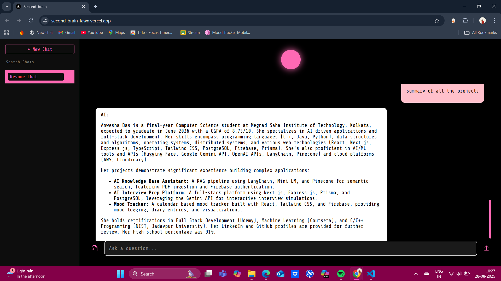
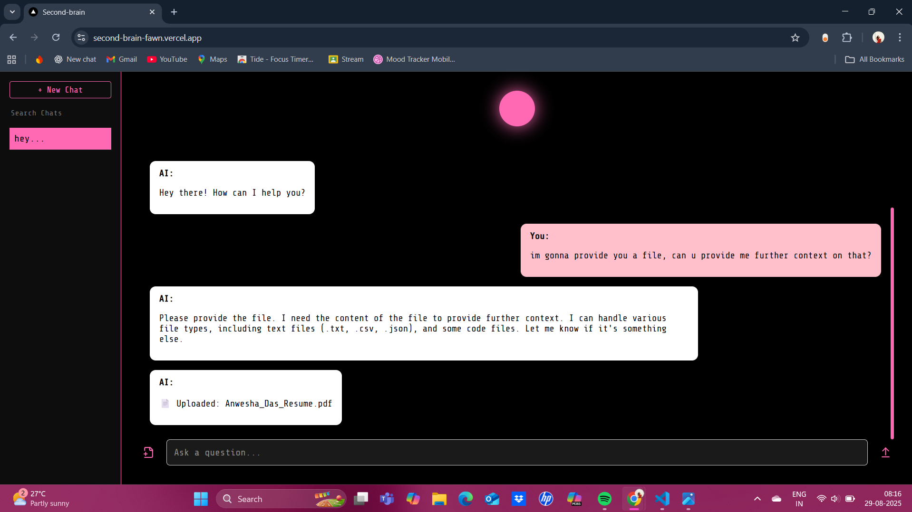
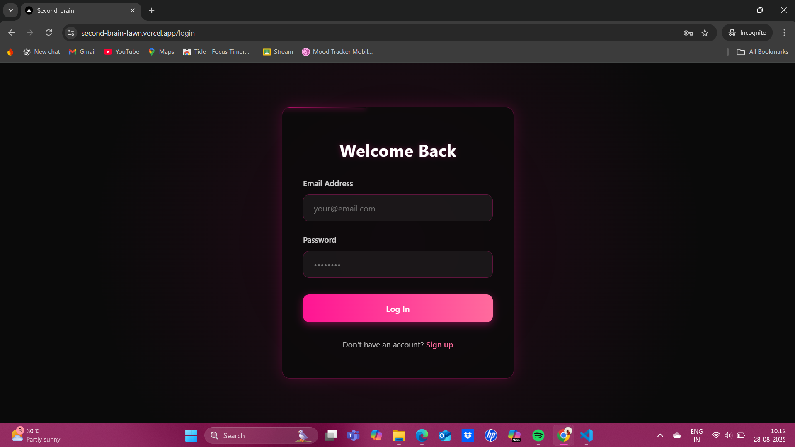

# 🧠⚡ Second Brain 🕹️

<div align="center">

[](LICENSE)
[](https://nextjs.org/)
[](https://reactjs.org/)
[](https://www.python.org/)


### 🌐 **[Live Demo](https://second-brain-fawn.vercel.app/)** | ⭐ **Star this repo**

*AI-Powered Personal Knowledge Base*  
**Store, retrieve, and chat with your knowledge** using RAG pipelines, embeddings, and a futuristic retro-dark UI.

</div>

---

## 🚀 Features & Superpowers

<table>
<tr>
<td>⚡ <strong>AI Knowledge Chat</strong></td>
<td>Converse with your stored documents, notes, and resources</td>
</tr>
<tr>
<td>📂 <strong>Smart Ingestion</strong></td>
<td>Upload PDFs, notes, and text—auto-chunked and embedded into vector DB</td>
</tr>
<tr>
<td>🤖 <strong>RAG Pipeline</strong></td>
<td>Context-aware answers powered by OpenAI + LangChain</td>
</tr>
<tr>
<td>🛡️ <strong>Secure Auth</strong></td>
<td>Firebase Auth + PostgreSQL for protected user spaces</td>
</tr>
<tr>
<td>🧩 <strong>Knowledge Orb</strong></td>
<td>Dynamic visualization of your stored knowledge base</td>
</tr>
<tr>
<td>🌌 <strong>Dark Retro UI</strong></td>
<td>Terminal-inspired aesthetics with smooth animations</td>
</tr>
</table>

---

## 💡 Why Second Brain?

> **Because your brain deserves an upgrade.**  
> Store, connect, and recall your knowledge instantly—with the vibe of a hacker terminal fused with AI superpowers. 🕹️

---

## 🖼️ Preview

<div align="center">

| 🧠 Chat Interface | 📂 Upload Portal | 🌌 Login Screen |
|:---:|:---:|:---:|
|  |  |  |

</div>

---

## ⚡ Quick Start

```bash
# 🔥 Clone & Setup
git clone https://github.com/anwexhaa/second-brain.git
cd second-brain

# 🎨 Frontend Setup
cd frontend
npm install  # or yarn/pnpm install

# 🐍 Backend Setup  
cd ../backend
pip install -r requirements.txt
```

### 🔐 Environment Variables

**Frontend** (`.env.local`)
```env
NEXT_PUBLIC_OPENAI_API_KEY=your_openai_api_key
NEXT_PUBLIC_FIREBASE_API_KEY=your_firebase_api_key
```

**Backend** (`.env`)
```env
OPENAI_API_KEY=your_openai_api_key
DATABASE_URL=your_postgres_url
FIREBASE_PROJECT_ID=your_firebase_project_id
VECTOR_DB_API_KEY=your_pinecone_or_chroma_key
```

### 🚀 Launch Servers

```bash
# Frontend (Terminal 1)
cd frontend && npm run dev

# Backend (Terminal 2)
cd backend && uvicorn main:app --reload
```

**🎉 Visit `http://localhost:3000` and start building your Second Brain!**

---

## 🛠️ Tech Stack

<div align="center">

| Category | Technologies |
|:---:|:---:|
| **Frontend** | Next.js, React, Tailwind CSS |
| **Backend** | FastAPI (Python) |
| **Database** | PostgreSQL + Pinecone (Vector DB) |
| **Authentication** | Firebase Auth |
| **AI Pipeline** | LangChain + OpenAI Embeddings |
| **Deployment** | Vercel + Railway/Render |

</div>

---

## 🌍 Deployment

- **🎯 Frontend**: Live at [second-brain-fawn.vercel.app](https://second-brain-fawn.vercel.app)
- **⚙️ Backend**: Deploy on Railway, Render, or any cloud provider
- **💾 Database**: Use Supabase or Neon for PostgreSQL
- **🔍 Vector DB**: Pinecone (managed) or Chroma (self-hosted)

---

## 🤝 Contributing

We love contributions! Here's how to get involved:

1. **🍴 Fork** the repository
2. **🌿 Create** your feature branch: `git checkout -b feature/amazing-feature`
3. **💾 Commit** your changes: `git commit -m 'Add amazing feature'`
4. **🚀 Push** to branch: `git push origin feature/amazing-feature`
5. **🎯 Open** a Pull Request

---

## 📄 License

This project is licensed under the [MIT License](LICENSE) - see the file for details.

---

<div align="center">

**⭐ Star this repo if it helped you build your Second Brain!**  

Made with 💜 by [anwexhaa](https://github.com/anwexhaa)

</div>